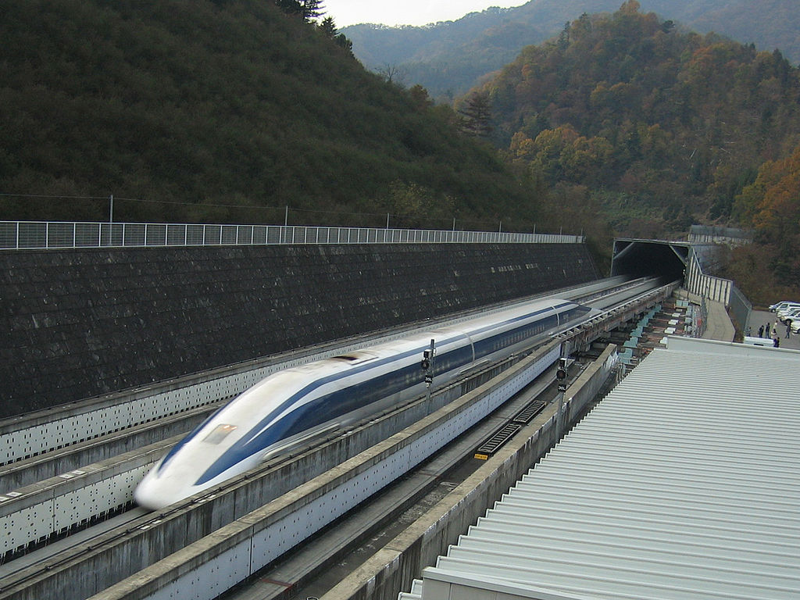

## Osaka Maglev Train - 新しい電車【大阪 ~ 東京】

**Maglev Train (600 km/h)**

[picture license](https://creativecommons.org/licenses/by-sa/3.0/deed.ja){:target="_blank"}

   >&nbsp;

   Maglev Train starts its service in 2027 from Oosaka to Toukyou.

   >*

